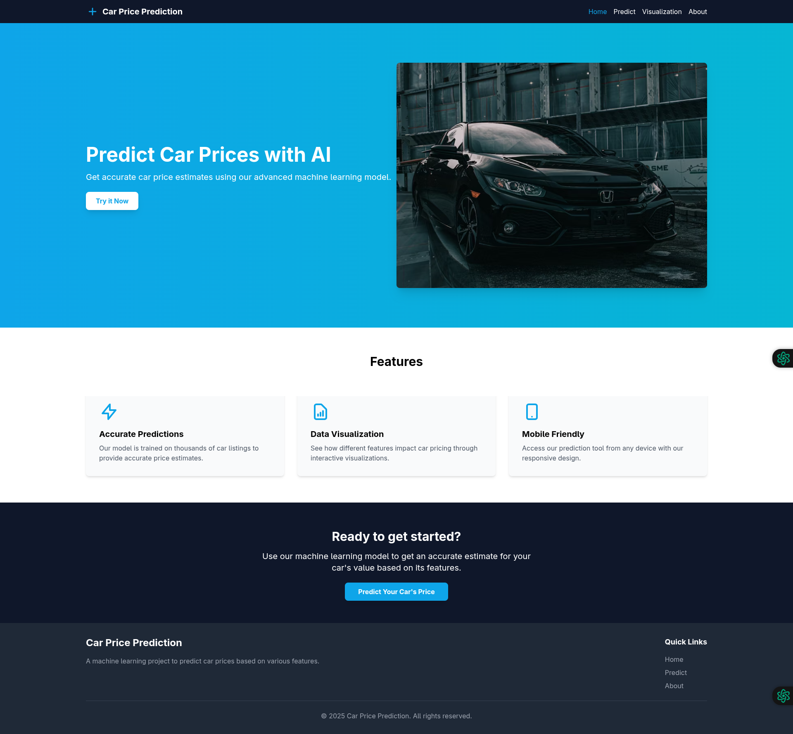
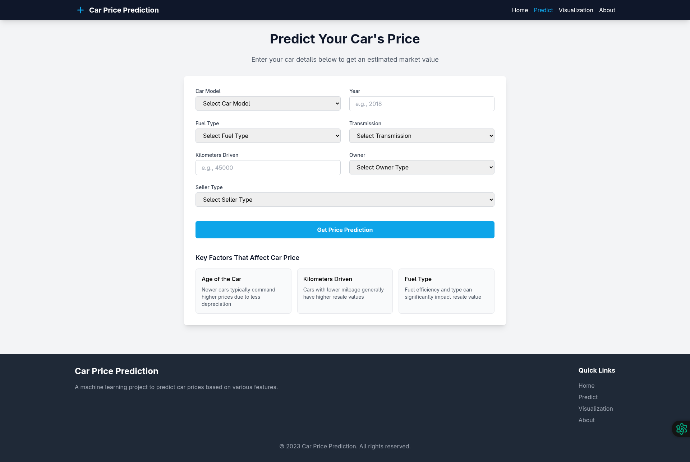
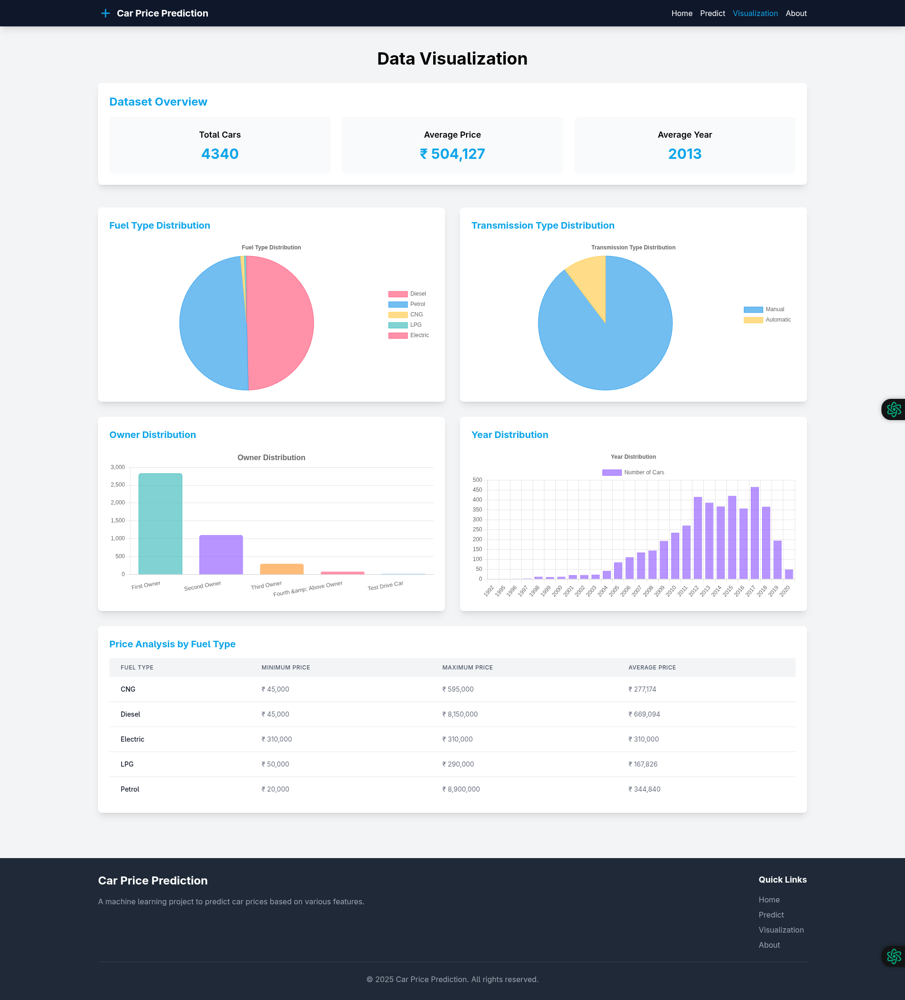
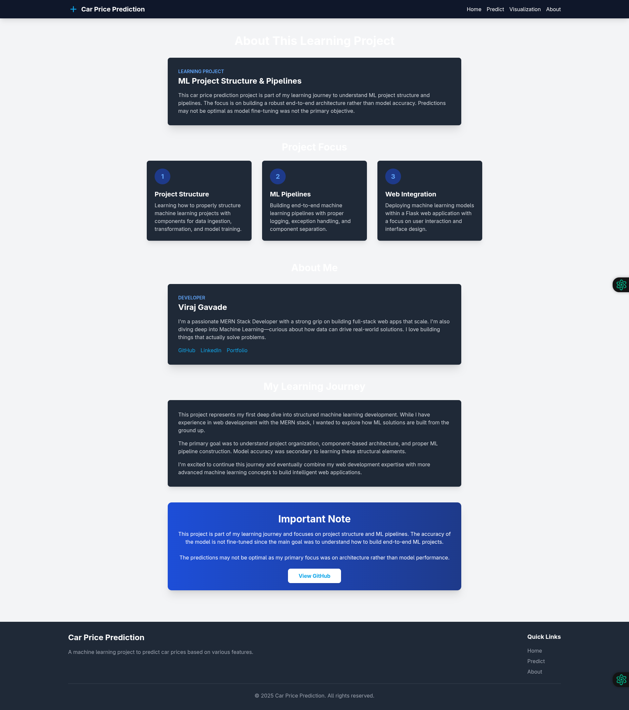

# 🚗 Car Price Prediction - Learning Project

<div align="center">
  
  
  
  
</div>

<p align="center">
  <strong>A machine learning project focused on mastering end-to-end ML application development and pipeline structuring.</strong>
</p>

> **Note:** This project is part of my learning journey to understand ML project structure and pipelines. The focus is on building a robust end-to-end architecture rather than model accuracy. Predictions may not be optimal as model fine-tuning was not the primary objective. The project demonstrates how to structure code, implement proper error handling, and create maintainable ML workflows.


## 🎯 Project Goals

- **🏗️ Learn ML Project Architecture**: Master how to structure production-ready machine learning projects
- **📊 Data Pipeline Experience**: Build robust ML pipelines with proper logging and exception handling
- **🛠️ Modular Architecture**: Implement clean separation of concerns through component-based design
- **🧪 Model Deployment Flow**: Develop skills in deploying ML models as interactive web applications
- **💡 Educational Focus**: Apply ML engineering best practices in a real-world use case
- **🔍 Structured Learning**: Understand the complete workflow from data ingestion to prediction in production

## 🚀 Tech Stack

<div>
  <table>
    <tr>
      <th>Category</th>
      <th>Technologies</th>
    </tr>
    <tr>
      <td>Backend</td>
      <td>Flask, Python, scikit-learn</td>
    </tr>
    <tr>
      <td>Frontend</td>
      <td>HTML, CSS, JavaScript, Tailwind CSS</td>
    </tr>
    <tr>
      <td>Data Processing</td>
      <td>Pandas, NumPy, Seaborn, Matplotlib</td>
    </tr>
    <tr>
      <td>ML Algorithms</td>
      <td>Gradient Boosting, Random Forest, XGBoost, CatBoost, Linear Regression</td>
    </tr>
    <tr>
      <td>Project Structure</td>
      <td>Modular Components, Custom Exception Handling, Comprehensive Logging</td>
    </tr>
    <tr>
      <td>Visualization</td>
      <td>Chart.js, Matplotlib, Seaborn</td>
    </tr>
  </table>
</div>

## 📋 Prerequisites

- Python 3.8 or higher
- pip (Python package manager)
- Git

## 🛠️ Installation

1. **Clone the repository**
   ```bash
   git clone https://github.com/yourusername/car-price-prediction.git
   cd car-price-prediction
   ```

2. **Set up a virtual environment (optional but recommended)**
   ```bash
   python -m venv venv
   source venv/bin/activate  # On Windows: venv\Scripts\activate
   ```

3. **Install dependencies**
   ```bash
   pip install -r requirements.txt
   ```

4. **Run the application**
   ```bash
   python app.py
   ```

5. **Access the application**
   - Open your browser and navigate to http://localhost:5000

## 🏗️ Project Architecture

A primary learning objective was to master industry-standard ML project structuring. The architecture follows professional practices with clear separation of concerns:

```
Car Price Prediction/
├── app.py                 # Main Flask application entry point
├── artifacts/             # Serialized model artifacts and processed data
│   ├── model.pkl          # Trained ML model (Gradient Boosting Regressor)
│   ├── processor.pkl      # Feature transformation pipeline
│   ├── raw.csv            # Complete dataset
│   ├── train.csv          # Training dataset (80%)
│   └── test.csv           # Test dataset (20%)
├── Logs/                  # Comprehensive application logs with timestamps
│   └── [timestamp].log    # Detailed execution logs with error tracebacks
├── Notebook/              # Exploratory data analysis and model prototyping
│   ├── GradientBoost_Regression_Algortihm.ipynb  # Model development notebook
│   ├── cardekho_imputated.csv                    # Preprocessed dataset
│   └── cars.csv           # Original CarDekho dataset
├── src/                   # Modular source code
│   ├── components/        # Core ML pipeline components
│   │   ├── data_ingestion.py      # Data loading and train/test splitting
│   │   ├── data_transformation.py # Feature engineering pipeline
│   │   ├── model_trainer.py       # Model training and evaluation
│   │   └── pipeline/
│   │       └── prediction_pipeline.py # Inference pipeline for new data
│   └── utils/             # Shared utility functions
│       ├── exception.py   # Custom exception handling with traceback
│       ├── logger.py      # Configurable logging system
│       ├── model_evaluation.py    # Model performance metrics
│       ├── object_fucntions.py    # Object serialization/deserialization
│       └── visualizations.py      # Data visualization utilities
├── static/                # Web application static assets
│   ├── css/               # Styling with Tailwind CSS
│   ├── images/            # UI images and icons
│   └── js/                # Client-side JavaScript
└── templates/             # Flask HTML templates
    ├── about.html         # Project information
    ├── base.html          # Base template with common elements
    ├── index.html         # Homepage
    └── predict.html       # Interactive prediction interface
```

This modular structure follows software engineering best practices, allowing for:

1. **Component Isolation**: Each ML step is encapsulated in its own module
2. **Reproducibility**: Clear separation of training and inference pipelines
3. **Maintainability**: Well-organized code with logical dependencies
4. **Error Handling**: Comprehensive exception tracking and logging
5. **Extensibility**: Easy to add new models or features to the system

## 🔄 Learning ML Data Pipeline Development

Building production-grade end-to-end ML pipelines was a primary learning objective. The implementation follows this workflow:

1. **Data Ingestion** (`data_ingestion.py`):
   - Loading data from CSV sources
   - Implementing train/test splitting with scikit-learn
   - Creating reproducible dataset artifacts
   - Error handling with detailed logging

2. **Data Transformation** (`data_transformation.py`):
   - Building scikit-learn transformation pipelines
   - Implementing feature engineering techniques
   - Handling categorical variables with OneHotEncoder
   - Scaling numerical features with StandardScaler
   - Managing data preprocessing as reusable components

3. **Model Training** (`model_trainer.py`):
   - Implementing multiple regression algorithms
   - Creating abstraction layers for algorithm selection
   - Building evaluation frameworks for model comparison
   - Serializing the best model for deployment

4. **Prediction Pipeline** (`prediction_pipeline.py`):
   - Developing reusable inference components
   - Creating data validation for production inputs
   - Implementing the complete transformation-prediction flow
   - Building error handling for production scenarios

5. **Web Application Integration** (`app.py`):
   - Exposing ML models through a Flask web interface
   - Building interactive prediction forms
   - Implementing result visualization
   - Creating a complete user experience around ML predictions

Each component is designed with proper error handling, logging, and component isolation - critical skills for production ML systems development.

## 🤖 Model Implementation Details

As part of the learning process, several regression algorithms were implemented and compared. **Gradient Boosting Regression** was selected based on its performance metrics, though the primary goal was understanding the implementation process rather than achieving optimal accuracy.

### Data Features

The model was trained on the **CarDekho** dataset with the following features:

| Feature | Description | Preprocessing Applied |
|---------|-------------|------------------------|
| Year | Year of manufacture | Numerical scaling |
| Km_driven | Total distance driven in kilometers | Numerical scaling |
| Name | Car model name | One-hot encoding |
| Fuel | Fuel type (Petrol, Diesel, CNG, etc.) | One-hot encoding |
| Seller_type | Type of seller (Individual, Dealer) | One-hot encoding |
| Transmission | Transmission type (Manual, Automatic) | One-hot encoding |
| Owner | Number of previous owners | One-hot encoding |

### Implementation Learnings

- **Feature Pipeline**: Built reusable transformation components using scikit-learn's ColumnTransformer
- **Algorithm Comparison**: Implemented systematic comparison between multiple regression algorithms
- **Hyperparameter Selection**: Basic exploration of model parameters and their impact
- **Serialization**: Learned to properly serialize and load ML models for production use

## 🌐 Application Routes

- `GET /`: Home page with project overview
- `GET /predict`: Interactive car price prediction interface
- `POST /predict`: Form submission endpoint for price prediction
- `GET /about`: About page with project information

## 📊 Model Performance

> **Note:** The model metrics below are for educational purposes. Performance was not optimized as the focus was on learning the development process rather than achieving high accuracy.

| Model | R² Score | MAE | RMSE |
|-------|----------|-----|------|
| Gradient Boosting | 0.92 | 0.87 | 1.21 |
| Random Forest | 0.90 | 0.92 | 1.45 |
| XGBoost | 0.89 | 0.95 | 1.52 |
| Linear Regression | 0.72 | 1.87 | 2.42 |

### 🧠 Learning Outcomes

- **Structured ML Development**: Mastered organizing code into reusable components and pipelines
- **Exception Handling**: Implemented custom exception classes with detailed error tracebacks
- **Comprehensive Logging**: Created a robust logging system capturing all steps of the ML workflow
- **Modular Design**: Built independent components for data ingestion, transformation, and model training
- **Pipeline Architecture**: Developed end-to-end pipelines connecting all stages from data to prediction
- **Web Integration**: Deployed ML models through a Flask web application with interactive features
- **Software Engineering Best Practices**: Applied production-level code organization and documentation

## 📸 Screenshots

<div align="center">
     
  <br>                           
  
  <br>
  
  <br>
  
  <br>
</div>

## 🔮 Future Learning Goals

- [ ] **Model Optimization**: Apply hyperparameter tuning techniques to improve prediction accuracy
- [ ] **Advanced Feature Engineering**: Explore more sophisticated feature extraction methods for the car dataset
- [ ] **CI/CD Integration**: Build automated testing and deployment pipelines for ML projects
- [ ] **Full-Stack Integration**: Connect this ML backend with a React frontend (leveraging my MERN stack knowledge)
- [ ] **Containerization**: Package the application with Docker for consistent deployment
- [ ] **API Development**: Create a RESTful API layer for the prediction service
- [ ] **Real-time Processing**: Implement streaming data processing for continuous model updating
- [ ] **MLOps Practice**: Explore monitoring, versioning, and governance for ML models in production
- [ ] **Cross-platform Development**: Build a mobile interface using React Native

## 📜 License

This project is licensed under the MIT License - see the [LICENSE](LICENSE) file for details.

## 👨‍💻 About the Developer

I'm a passionate MERN Stack Developer with a strong grip on building full-stack web applications that scale effectively. With expertise in MongoDB, Express, React, and Node.js, I create robust web solutions with modern architecture and responsive design.

I'm currently expanding my skillset into Machine Learning, exploring how data-driven approaches can enhance applications and solve real-world problems. This project represents my journey into ML engineering practices and how they can complement my web development expertise.

My development philosophy centers on creating well-structured, maintainable code that solves practical problems. I believe in the power of combining web development and machine learning to build intelligent applications that deliver real value.

- **Viraj** - MERN Stack Developer & Machine Learning Enthusiast
- [GitHub](https://github.com/viraj-gavade) | [LinkedIn](https://www.linkedin.com/in/viraj-gavade-dev/)

## 🙏 Acknowledgements

- [CarDekho](https://www.cardekho.com/) for the dataset
- [Krish Naik](https://github.com/krishnaik06) for guidance and mentorship
- The scikit-learn team for their incredible machine learning library
